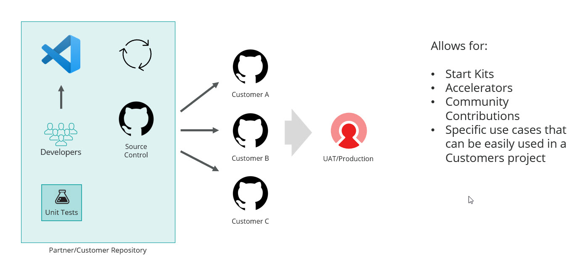
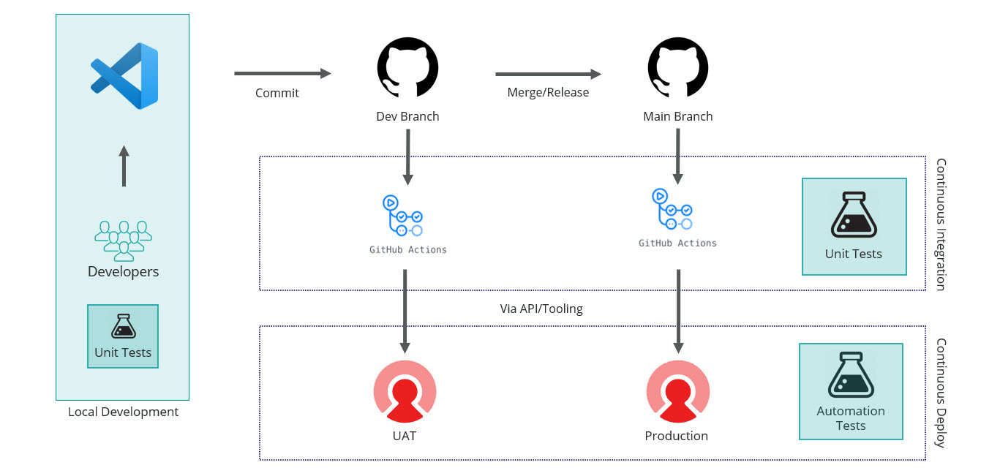

# Introduction

The purpose of this repository is to showcase how you can setup the process of storing Sitecore CDP + Personalize templates, connections and other development resources in Source control for a proper development life cycle with the CDP/Personalize products.

## Getting Started

If you would like to use this for your next repository, you can simply click on the `Use this template` button on github and create a new repository with this as the baseline. There are a few examples and `Readme.md` littered throughout the repository.

### Un-opinionated

This repository although it has many examples for CI/CD, unit testing and automation testing, the tools that were used to enable those features, are optional and you can pick and choose the frameworks/tools that your team is the most familiar with.

## Reusability

This repository provides an example of how a repository could be setup to create a reusable library for your customers or all customers depending on the scenario. All of this is possible with the Serializer tool with Sitecore CDP/Personalize available on NPM: (https://www.npmjs.com/package/sitecore-cdp-serializer)[https://www.npmjs.com/package/sitecore-cdp-serializer]. This is currently a pre-release open source package.

## Typical Customer Scenario

Most Sitecore CDP/Personalize customers are provided a two tenant setup depending on the license for CDP, Personalize or both CDP/Personalize (Smart Hub CDP solution). This repository could be used for creating a CI/CD process with the DevOps tool of choice to deploy these changes to your CDP/Personalize tenant.

